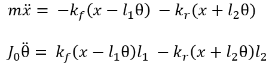
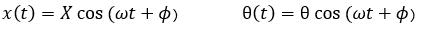
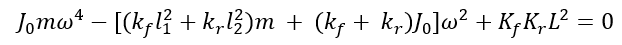

An automobile carries passengers or goods from one place to another. Generally, it consists of a suspension, tire, and other electrical systems which assist in either the maintenance or efficient functioning of the vehicle. The automobile can be modeled as a two-degree-of-freedom lumped parametric system to study pitch and bounce motions, as shown in Figure 1.

Fig. 1. Pitch and bounce motion of a Car

As a two-degree of freedom system, x (bounce) and &theta; (pitch) are the independent parameters that will give the equations of motion.

In the matrix form,

Assuming a harmonic solution,

We get,

Upon solving and simplifying,

Where L = l1 + l2

This equation is used to solve for &omega;, which are the roots of the equation

