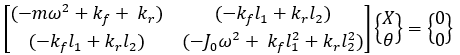

An automobile carries passengers or goods from one place to another. Generally, it consists of a suspension, tire, and other electrical systems which assist in either the maintenance or efficient functioning of the vehicle. The automobile can be modeled as a two-degree-of-freedom lumped parametric system to study pitch and bounce motions, as shown in Figure 1.

<!--    -->

  

Fig. 1. Pitch and bounce motion of a Car  

As a two-degree of freedom system, x (bounce) and &theta; (pitch) are the independent parameters that will give the equations of motion.

<!--  -->

$m\ddot x = -k_f(x - l_1 \theta) - k_r(x+l_2\theta) $

$J_0\ddot \theta = k_f(x - l_1 \theta)l_1 - k_r(x + l_2\theta)l_2$

In the matrix form,

<!--  -->

$$
\begin{bmatrix}
m & 0 \\
0 & J_{0}
\end{bmatrix}
\begin{Bmatrix}
\ddot{x} \\
\ddot{\theta}
\end{Bmatrix} +
\begin{bmatrix}
(k_{f} + k_{r}) & -(k_{f}l_{1} - k_{r}l_{2}) \\
-(k_{f}l_{1} - k_{r}l_{2}) & (k_{f}l_{1}^{2} + k_{r}l_{2}^{2})
\end{bmatrix}
\begin{Bmatrix}
x \\
\theta
\end{Bmatrix} =
\begin{Bmatrix}
0 \\
0
\end{Bmatrix}
$$

Assuming a harmonic solution,

<!--  -->

$x(t) = X  cos(\omega t + \phi)   \space  \space\space\space\space\space\space\space\space\space\space\space\space              \theta(t) = \theta \cos(\omega t + \phi)$

We get,

<!--  -->

$$
\begin{bmatrix}
(-m\omega^{2}+k_{f}+k_{r}) & (-k_{f}l_{1}+k_{r}l_{2}) \\
(-k_{f}l_{1}+k_{r}l_{2}) & (-J_{0}\omega^{2}+k_{f}l_{1}^{2}+k_{r}l_{2}^{2})
\end{bmatrix}
\begin{Bmatrix}
X \\
\theta
\end{Bmatrix}
=
\begin{Bmatrix}
0 \\
0
\end{Bmatrix}
$$

Upon solving and simplifying,

<!--  -->

$J_{0}m\omega^{4}-[(k_{f}l_{1}^{2}+k_{r}l_{2}^{2})m+(k_{f}+k_{r})I_{0}]\omega^{2}+K_{f}K_{r}L^{2}=0$

Where $L = l_1 + l_2$

This equation is used to solve for &omega;, which are the roots of the equation
<!--  -->

$\omega^{2}_{1,2}=\frac{[(k_{f}l_{1}^{2} \space + \space k_{r}l_{2}^{2}) m\space + \space(k_{f}+k_{r})I_{0}]\space\pm\space\sqrt{[(k_{f}l_{1}^{2}\space +\space k_{r}l_{2}^{2})m\space+\space(k_{f}\space +\space k_{r})I_{0}]^{2}\space -\space [4I_{0}mK_{f}K_{r}L^{2}}]}{2I_{0}m}$

